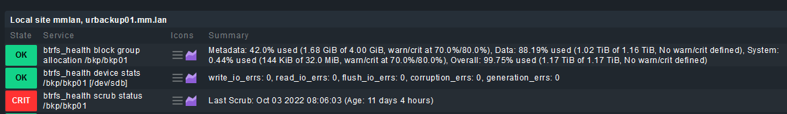

# [Check MK](https://checkmk.com) Plugin to check the health of btrfs filesystems

# Installation

## On the Monitoring Server where Check_mk is installed:
For a detailed description how to work with mkp's goto [https://docs.checkmk.com/latest/de/mkps.html](https://docs.checkmk.com/latest/de/mkps.html).

### Short tasks
1. copy the XXXXXX.mkp (see [dist](dist) folder) to your Check_mk server into the /tmp folder.
2. su - <SITE_NAME> (mkp has to be installed on every site you are running!)
3. mkp install /tmp/XXXXXX.mkp (replace XXXXXX with the filename downloaded)
4. Check if installation worked
```
OMD[mmlan]:~$ find . -iname 'btrfs_health*.py'
./local/share/check_mk/web/plugins/perfometer/btrfs_health.py
./local/share/check_mk/web/plugins/metrics/btrfs_health_metric.py
./local/share/check_mk/web/plugins/wato/btrfs_health.py
./local/lib/python3/cmk/base/plugins/agent_based/btrfs_health.py
...
```
5. Goto your Check_mk webinterface. Open "Service Rules" and search for BTRFS. BTRFS Health items should appear.

## On the Linux Server with the btrfs filesystem (NOT THE CHECK_MK SERVER!):
1. Copy the plugin script [src/local/share/check_mk/agents/plugins/btrfs_health](src/local/share/check_mk/agents/plugins/btrfs_health) into /usr/lib/check_mk_agent/plugins/
2. chmod 755 /usr/lib/check_mk_agent/plugins/btrfs_health
3. Execute the script: /usr/lib/check_mk_agent/plugins/btrfs_health. If everythings works the output should look like:
```
<<<btrfs_health_dstats>>>
btrfs-progs v4.20.1
stats::/bkp/bkp01 [/dev/sdb].write_io_errs    0
stats::/bkp/bkp01 [/dev/sdb].read_io_errs     0
stats::/bkp/bkp01 [/dev/sdb].flush_io_errs    0
stats::/bkp/bkp01 [/dev/sdb].corruption_errs  0
stats::/bkp/bkp01 [/dev/sdb].generation_errs  0
<<<btrfs_health_usage>>>
btrfs-progs v4.20.1
usage::/bkp/bkp01 Overall:
usage::/bkp/bkp01     Device size:                   1288490188800
usage::/bkp/bkp01     Device allocated:              1285297274880
usage::/bkp/bkp01     Device unallocated:                       3192913920
usage::/bkp/bkp01     Device missing:                            0
usage::/bkp/bkp01     Used:                          1129520091136
usage::/bkp/bkp01     Free (estimated):               153920942080      (min: 152324485120)
usage::/bkp/bkp01     Data ratio:                                     1.00
usage::/bkp/bkp01     Metadata ratio:                         2.00
usage::/bkp/bkp01     Global reserve:                    536870912      (used: 0)
usage::/bkp/bkp01
usage::/bkp/bkp01 Data,single: Size:1276640231424, Used:1125912203264
usage::/bkp/bkp01    /dev/sdb   1276640231424
usage::/bkp/bkp01
usage::/bkp/bkp01 Metadata,DUP: Size:4294967296, Used:1803796480
usage::/bkp/bkp01    /dev/sdb   8589934592
usage::/bkp/bkp01
usage::/bkp/bkp01 System,DUP: Size:33554432, Used:147456
usage::/bkp/bkp01    /dev/sdb     67108864
usage::/bkp/bkp01
usage::/bkp/bkp01 Unallocated:
usage::/bkp/bkp01    /dev/sdb   3192913920
<<<btrfs_health_scrub>>>
btrfs-progs v4.20.1
scrub::/bkp/bkp01 scrub status for 253728d8-e806-437d-acc1-1456aaf79e91
scrub::/bkp/bkp01       scrub started at Mon Oct  3 08:06:03 2022 and finished after 06:04:01
scrub::/bkp/bkp01       total bytes scrubbed: 1.06TiB with 0 errors
```

## Services screenshot

